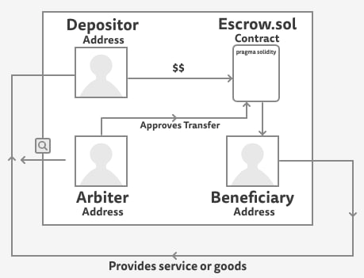

# Escrow contract

An escrow is an agreement often used when transferring funds in exchange for a good or service. Funds can be held in escrow and a third party can be chosen to "arbitrate" or approve the transfer when the service or good is provided.

Each time that a depositor, arbiter and beneficiary come to an agreement upon Escrow terms, they can deploy a contract.

The depositor will be the deployer of the contract. They will ask the arbiter and beneficiary for addresses that those two parties have access to. Then the depositor will provide those addresses as the arguments to the Escrow contract for storage.

After the contract has been deployed with the appropriate amount of funds, the beneficiary will provide the good or service. They are now secure in knowing that the money is on its way! 

Once the good or service is provided, the arbiter needs a way to approve the transfer of the deposit over to the beneficiary's account.
